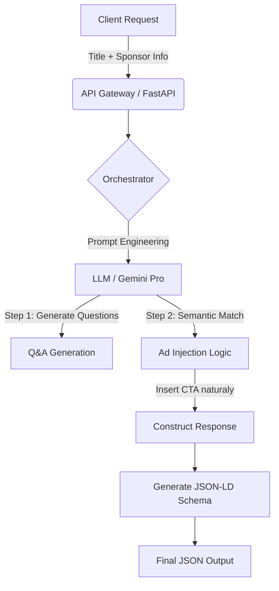

# ContextFlow PAA 🦎

**ContextFlow PAA** is an intelligent microservice designed to boost SEO and monetization simultaneously. It generates "People Also Asked" (PAA) FAQ sections for blog posts using Generative AI and contextually injects sponsor CTAs (Call to Actions) into the most semantically relevant answer.

> **Part of the [Postly] ecosystem.**

## 🚀 The Problem

Traditional PAA tools rely on expensive, slow scraping APIs (SERP) and produce generic content. Furthermore, monetizing informational blog posts is often intrusive (banners, popups) and harms User Experience.

## 💡 The Solution

ContextFlow uses **Semantic Inference** instead of scraping. It analyzes the blog post title to predict high-intent user questions. Then, using a **Context-Aware Injection Algorithm**, it seamlessly weaves a sponsor's value proposition into the answer where it makes the most sense (e.g., injecting an Accounting Firm ad specifically into a question about "Taxes", avoiding it in questions about "Marketing").

## 🏗 Architecture

The system is built as an asynchronous API using **FastAPI** and **Pydantic** for strict data validation.

## Key Features

- Zero-Scraping Latency: No dependency on Google/Bing APIs. Questions are inferred via AI based on search intent patterns.
- Smart Ad Injection: The system evaluates the "Sponsor Context" against generated questions to find the perfect match.
- Example: If the sponsor is a "Law Firm", the ad appears in legal-related questions, not general ones.
- SEO Native: Automatically generates valid application/ld+json (FAQPage Schema) for Google Rich Snippets.
- Structured Output: Uses Pydantic to guarantee strict JSON format, preventing AI hallucinations from breaking the frontend.

## ⚡ Tech Stack

- Core: Python 3.11+
- Framework: FastAPI (Async/Await)
- Validation: Pydantic V2
- AI Engine: Google Gemini (configurable to OpenAI)
- Containerization: Docker & Docker Compose

## 🤝 Contributing

This project is part of my portfolio demonstrating Senior Backend Engineering concepts. Feel free to open issues or PRs.

Built with ☕ and Code by [EliasOlie](https://github.com/eliasolie)
